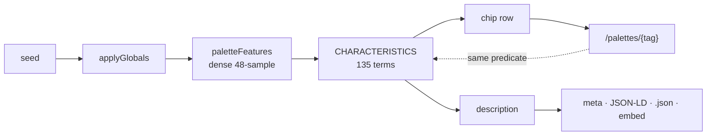

# Palette description & tagging — passoff

Written 2026-08-19 for whoever audits and improves this next.

**Read the code, not this file.** Every pointer below is `path:line` so you can go
straight to the source. This document is a map, deliberately thin — the real
reasoning lives in comments next to the code it explains, and those comments
record measurements. Where this file and the code disagree, **the code is right
and this file is stale.** Do not treat any number here as verified until you have
re-run the measurement yourself; the harness for doing that is in the tests.

---

## What it does

A cosine gradient is a formula, so everything true about it is computable. The
system turns those measurements into three outputs per palette:

```text
title        "Mocha to deep sea blue to midnight"
description  prose — NOT rendered on the page; feeds meta, JSON-LD,
             /{seed}.json and the vector-search embedding text
tags         the chip row under the palette, each linking to /palettes/{tag}
```

## Where things live

```text
packages/data-ops/src/
├── color-utils.ts                       920-name corpus, OkLab, gamut ceiling
│     maxChromaFor()                :554   max in-gamut chroma at (L,h)
│     getUniqueColorNames()        :1145   farthest-point name selection
└── gradient-gen/
    ├── palette-modifiers.ts            features + the older descriptor registry
    │     paletteFeatures()       :1190   ONE dense 48-sample pass; everything reads this
    │     classifyStructure()     :1682   exclusive: grayscale|monochrome|duotone|
    │                                     complementary|analogous|multicolor|rainbow
    └── palette-characteristics.ts       THE REGISTRY — start here
          PROMINENCE_CEILING      :1185
          CHIP_SUPPORT_FLOOR      :1231
          prominentCharacteristics():1269
          CHARACTERISTICS         :2612   135 terms

apps/web/src/
├── palette-name.ts                      the name + the URL-keyed nouns
│     titleSuffix()                :112   " Gradient" / " Palette" / " Gradient Palette"
│     viewNounPlural()             :136   list-page heading noun, same rule
│     describePaletteName()        :450
├── palette-prose.ts                     chips + description (both read the registry)
│     paletteProse()              :2513
│     paletteEmbedText()          :2593   canonical embedding composition
│     CHIP_MAX                    :3056
│     relatedSearches()           :4685   THE CHIP ROW
│     describePalette()           :4942   the {title, description, tags} entry point
├── tag-search.ts                        chip destinations — SAME predicates
│     recognizeTagQuery()          :429
│     applyTagFilter()             :776
├── palette-json.ts
│     seedPaletteText()            :123   one analysis → every surface
├── pages.ts
│     paletteContext()             :735   renders the chip nav; NO paragraph since D22
└── index.ts
      indexableQuery()             :435   which query pages may be indexed
```

## Flow



The dotted line is load-bearing: a chip and the page it links to are filtered by
the same function, so they cannot disagree. Preserve that if you refactor.

## The selection rule

```text
tag(term) if
  test(palette)                  true at all
  and strong(palette)            true with MARGIN, not sitting on the threshold
  and strongPrevalence <= 0.6    discriminating, not near-universal
  and prevalence >= 24/867       its destination page can fill one screen

then rank by rarity
     let survivors shadow what they imply   (jewel → deep, neon → vivid)
     cap the row
```

Registry exhaustive, row selective. Adding terms should make the row *more*
selective, never longer. If you add a term and rows get longer, something is wrong.

## Rules that are not negotiable without measuring first

1. **Hue/structure facts read the dense coefficient sample, tone may read
   rendered stops.** Reading structure off `steps` is a sampling artifact —
   duotone measured 42% at 3 steps and 19.5% at 24. See the header of
   `palette-modifiers.ts`.
2. **Identity questions take relative saturation; loudness questions take
   absolute chroma.** Near white the gamut holds C≈0.04, at mid-lightness ≈0.14,
   so one absolute threshold cannot serve both. This was a real shipped bug:
   vivid pastels classified `grayscale` while sitting at 90–101% of achievable
   chroma. `maxChromaFor()` is the fix.
3. **A tag is a claim about the whole palette.** Per-stop and endpoint facts
   (`near-black`, value bands) are measured and kept as tags/embed values but are
   `tagOnly` — they are not offered as chips. This was the second shipped bug.
4. **Every prevalence in the registry is measured, never estimated,** and the
   suite re-measures and fails on drift. If you change a threshold, re-measure
   and update the recorded number in the same commit.
5. **The description never uses analysis vocabulary** (chroma, lightness, WCAG,
   degrees, cluster…) or em dashes, and stays translation-friendly — the audience
   is global. Chips *do* use color-theory terms; that split is intentional
   (prose is read, chips are filtered).

## Verifying your work

```bash
export NVM_DIR="$HOME/.nvm" && . "$NVM_DIR/nvm.sh" && nvm use 25   # Node 25 REQUIRED for builds
pnpm build:data-ops          # after ANY packages/data-ops/src change; apps import dist/
cd apps/web && pnpm typecheck && npx vitest run
```

Baseline: **450 pass, 2 fail.** The two failures — `analytics.test.js`,
`export.test.js` — predate this work and are unrelated. Anything else red is yours.

| file | what it guards |
|---|---|
| `apps/web/test/palette-characteristics.test.js` | every term fires only under its predicate; re-measures all shipped rates |
| `apps/web/test/palette-prose.test.js` | chip distributions, banned vocabulary, determinism, step-invariance |
| `apps/web/test/tag-search.test.js` | the filter keeps only satisfying palettes |
| `apps/web/test/prose-corpus.js` | the 867-seed fixture everything is measured over |

**Look at the palette.** Correctness here cannot be read off the code. Render it
and grade the text against the image — that is how both real bugs were found:

```bash
node <scratch>/render-palette.mjs <seed> out.png 7        # or --hexes "#a,#b"
```

The renderer writes a smooth band over the discrete stops; read the PNG with the
image tool. If you no longer have it, it is ~80 lines: decode seed → `applyGlobals`
→ `cosineGradient` → zlib PNG.

## Traps that cost time

- **Concurrent sessions.** Another session works in `apps/admin/` and commits
  broadly. Do not touch `apps/admin/`. A wide `git add` from that session once
  committed scratch test files into HEAD.
- **Build races.** A test run started before `pnpm build:data-ops` finishes reads
  a stale `dist/` and can look green. If a result surprises you, run it twice.
- **Float boundaries.** A term's shipped rate flip-flopped between identical runs
  because a palette sat one float bit from its threshold
  (`PURPLE_LINE_TIE` in `palette-characteristics.ts`). When a drift test fails by
  exactly `1/867`, suspect a boundary before suspecting a regression.
- **Scratch files.** Put harnesses outside the repo, or delete them. Do not leave
  `zz-*.test.js` behind.
- **Nothing is committed.** All of this is working-tree only, and nothing is
  deployed to production. Staging is `pnpm deploy:staging` from `apps/web`;
  smoke-test with `curl -L` (unfollowed redirects look like empty pages).

## Open work

- **View intent in the query path.** `/palettes/nautical-swatches` should set the
  default view. This matters because canonicals strip `?style=`/`?steps=`
  (verified live), so a param variant can never rank — a path can. Must cover the
  OG and PNG endpoints (`seo.ts` `queryPngResponse` / `queryOgResponse`), whose
  cache key is built from raw params and **will collide** once view words are
  stripped from the query text. Precedence: explicit param > path intent >
  default, per axis.
- **The reindex.** Five items wait on rebuilding Vectorize from
  `paletteEmbedText`, including correcting a legacy `texture:'monochrome'` tag
  that means grayscale and misses 146 of 148 true monochromes. Until then the
  query side must NOT be enriched with the new vocabulary — the index has never
  seen it, and one-sided enrichment degrades matching.
- **Structure-tag retrieval is weak** (11.5% precision) for the same reason: the
  live index has no word for hue geometry.
- **Bundle.** The editor island is ~12KB gzip over the pre-work baseline, against
  a 4KB budget I set. Lazy-loaded and off first paint, but unresolved.
- **Chip labels.** Some terms still read as internal ids rather than theory
  vocabulary. A `label`/`term` split was specced and deliberately not built,
  because the owner asked for no drastic changes.

## Deeper background

`seo-research/palette-prose.md` (architecture + measured tables),
`seo-research/palette-modifiers.md` (the descriptor axes and step-stability
evidence), `seo-research/color-corpus.md` (why these 920 names).
`PALETTE-NAMING-PASSOFF.md` is the earlier handoff and is now partly superseded.

These are long and were written alongside the code. Trust the tables that say how
they were measured; re-measure anything you are about to depend on.
