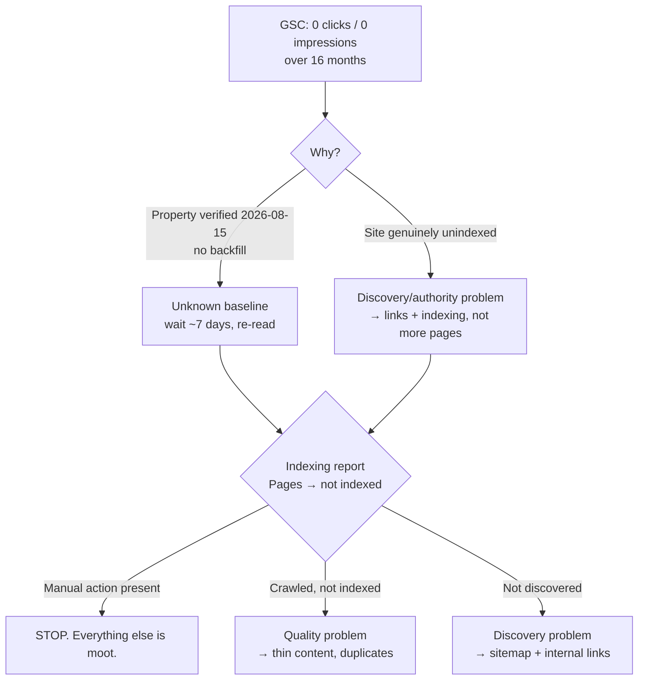
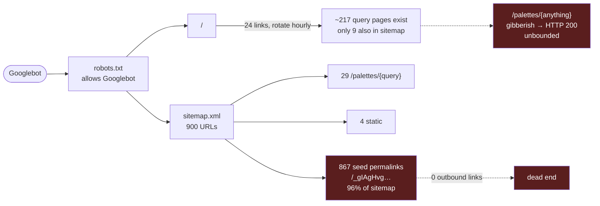

# SEO passoff — grabient.com

Handoff for a session owning organic search. Read top to bottom once, then use as an index.

Produced 2026-08-15 by a 6-agent audit (5 investigators + 1 adversarial critic, 60 findings).
Full transcript: `~/.claude/projects/-home-korz-projects-grabient33-grabient/*/subagents/workflows/wf_29a0df60-20b/journal.jsonl`

---

## Read this first

Organic search is the growth channel. Today the site earns **zero measured Google traffic**.

```text
69,000 browser pageviews/day        ← real, but source unknown
     ↓
       0 clicks, 0 impressions      ← Search Console, 16-month window
     ↓
   160 signups/month                ← ~1 per 13,000 pageviews
     ↓
    29 activated users/month        ← 18% of signups ever like anything
```

**Do not start by writing code.** The audit's five investigators all converged on
"generate 148 more query pages." The critic dismantled that. Resolve the three
unknowns below first — they point to opposite plans.

---

## The three unknowns that decide everything



1. **Is there a manual action?** GSC → Security & Manual Actions. Visible immediately,
   independent of performance data. A manual action would explain everything and
   invalidate the rest of this document. *Nobody checked.*
2. **Is 0 impressions real, or just an unverified-history artefact?** Re-run the
   Search Console read in ~7 days. Verified empirically today: a 480-day query
   returns `responseAggregationType: byProperty` with **no rows at all**.
3. **Where do 69k daily pageviews come from, if not Google?** ~55% are bots. The rest
   show as "Direct / no referrer." That is not normal for a content site.

> ⚠️ Correction to earlier session notes: it was stated that GSC "starts collecting
> from verification." A reviewer countered that GSC backfills 16 months on domain
> verification. **Both were asserted without evidence. The measured answer is zero
> rows, which does not distinguish the two.** Do not repeat either claim.

---

## What you inherit (working — do not rebuild)

The audit's single biggest miss: **five agents filed "GSC has no data" as a blocking
unknown while a committed, wired-up Search Console client sat in the repo.** Read it
before anything else.

```text
apps/admin/                          # admin.grabient.com, Cloudflare Access-gated
├── src/search-console.ts            # GSC client: queries, pages, CTR, position
│                                    #   service-account auth, property auto-discovery
├── src/traffic.ts                   # Cloudflare zone analytics + bot split
│                                    #   + loadReferrers() = RUM referrer data
├── src/queries.ts:200               # loadAttribution() — signups by first-touch source
└── src/brief.ts                     # /brief.json — machine-readable, for an agent
```

| Credential | Status | Gives you |
|---|---|---|
| `GSC_SERVICE_ACCOUNT` | ✅ set | Search Console API, `sc-domain:grabient.com` |
| `CF_ANALYTICS_TOKEN` + `CF_ZONE_ID` | ✅ set | zone analytics, bot split, top paths |
| `CF_ACCOUNT_ID` | ✅ set | RUM referrers (Web Analytics, enabled 2026-08-15) |

Query GSC directly with `jose` + the service-account JSON — see `search-console.ts`
for the exact two-legged OAuth flow. **`/brief.json` carries `definitions`, `caveats`
and `unavailable`; read `unavailable` before asserting anything.**

---

## Terrain: what a crawler actually meets



### Route inventory

| URL shape | Count | Indexable | Verdict |
|---|---:|:---:|---|
| `/palettes/{query}` | **unbounded** | ✅ 200 | Highest value **and** a crawl trap. Gibberish returns 200 + 48 results. |
| `/{seed}` | **unbounded** | ✅ 200 | Any valid-encoding string mints a page. Degenerate ones render solid black, title `#000000`. |
| `/palettes/{seed}` | 867 | ✅ 200 | Duplicate of `/{seed}` with a *different* self-canonical. |
| `/`, `/newest`, `/oldest` × 37 pages | 111 | ✅ 200 | Same 867 palettes in 3 orderings. All self-canonical. |
| `grabient-lite.jkorzhuk.workers.dev` | full site | ✅ 200 | **Staging is a self-canonical duplicate of the whole corpus.** |

---

## Findings by severity

Each links to its evidence. Severity is the *investigators'* — the critic disputes
several (see next section).

### Blocking / high — structural

| # | Finding | Evidence |
|---|---|---|
| 1 | **96% of the sitemap is near-duplicate hex-titled dead ends** with zero outbound links and one byte-identical meta description across all 866 | `pages.ts:733`, `seo.ts:113` |
| 2 | **`/palettes/{anything}` is unbounded and indexable; the noindex guard is dead code.** `pageRobots: total ? undefined : "noindex,follow"` can never fire — Vectorize `topK=48` always returns 48 | `index.ts:472`, `semantic-search.ts:58-67` |
| 3 | **`/{seed}` decodes procedurally with no existence check** — the whole encoding space is indexable, not the 867 real palettes | `palette.ts:26-33` |
| 4 | **Staging duplicates the site**, self-canonical to workers.dev, own 327-URL sitemap | `wrangler.jsonc:66,127` |
| 5 | **Title/H1 intent mismatch on the pages that already rank.** `<title>Grabient - Purple palettes</title>` — the word *gradient* appears in neither title nor H1 | `index.ts:466-470` |
| 6 | **182 legitimate query terms exist in code; 29 reach the sitemap.** 148 of 170 themes are discoverable only in an hourly rotation — one crawl sees 13 | `popular-searches.ts:93-264` |
| 7 | **Every palette carries a `tags[]` array that is parsed then discarded** — the biggest untapped content source in the product | `semantic-search.ts:29-46` |
| 8 | **`/newest`, `/oldest`, `/saved` are orphaned** — sort nav is a `<select>`, not links. Deepest palettes sit **17 clicks** from home | report 3 |
| 9 | **Zero `` tags anywhere** — Google Images is structurally unreachable | report 2 |
| 10 | **Query pages have 0.92% text-to-HTML ratio**, zero `<p>` elements, keyword mentioned once | report 5 |

### Medium — worth doing, not first

<details>
<summary>11 more (pagination canonicals, ItemList JSON-LD errors, emoji query pages, http→https cache bug, sitemap silent-degradation, X-Robots-Tag, param-reorder hops…)</summary>

- Paginated pages reuse page 1's title/description/H1 with self-canonicals
- `ItemList` JSON-LD points at non-canonical URLs and misstates `numberOfItems`
- Sitemap has no `<lastmod>`; on D1 failure it silently serves a valid 200 with **33 URLs** (`index.ts:1034-1036`)
- `http://grabient.com` returns cached 200 instead of 301 — the redirect never runs for cached URLs
- Emoji-only query pages (`/palettes/%F0%9F%94%A5`) are homepage-linked and indexable
- Seed pages: 6 internal links each, none to another palette
</details>

---

## What nobody checked

The critic's list. These are where research should start — not the code findings above.

```text
UNEXAMINED
├── Manual actions / security issues     ← would invalidate everything. 2 minutes.
├── Backlinks & referring domains        ← "it has no links" is at least as likely a
│                                           cause as anything found. Zero of 60
│                                           findings mention off-page.
├── Competitor SERPs                     ← nobody looked at coolors.co, cssgradient.io,
│                                           or one actual result page. Expanding into a
│                                           DR80-owned SERP ≠ into an empty one.
├── Search demand data                   ← all 5 agents recommend +148 theme pages.
│                                           The only empirical signal (purple, blue,
│                                           rose) says COLORS win, themes are unproven.
├── The rendered DOM                     ← all 5 curl'd raw HTML. Google indexes the
│                                           rendered DOM. entry.tsx:58 removes the SSR
│                                           grid after mounting a virtualizer starting
│                                           at viewportW=0. Untested, cheap to test.
├── Mobile-first indexing                ← Google indexes the mobile page. Every figure
│                                           in this document is desktop-only.
├── Organic share of the 69k/day         ← every severity above is scored against an
│                                           unknown denominator.
└── Scaled-content-abuse exposure        ← the site is already 96% machine-generated
                                            with one shared meta description. "Generate
                                            more pages" may be the wrong direction.
```

### Claims to distrust

| Claim in the audit | Problem |
|---|---|
| "GSC has no data because it was just verified" | Load-bearing excuse in all 5 reports, and unproven. Measured: 0 rows over 16 months — which proves neither reading. |
| "866 thin seed pages — remove or noindex them" | These are the product's shareable permalinks. Killing them forfeits whatever social/backlink equity exists. One-sided. |
| "72KB inlined CSS is a high-severity CWV problem" | Inlining avoids a render-blocking round trip. Externalising could make first-visit LCP *worse*. CWV is a weak tiebreaker. |
| "182 legitimate query terms exist" | Self-refuting: the same report proves gibberish also returns 200 with results. "Renders results" cannot be the legitimacy test. |
| "Unbounded crawl traps are high severity" | True but unsized — nothing links a gibberish query. Traps matter in proportion to inbound links. |

---

## Ranked actions

```text
DECISIVE                                                          effort
├── Read the GSC data that already exists (+ manual actions)      trivial  ← START
└── Answer the funnel question before scaling the top of it       small
       brief.ts:211 signups-per-100k · queries.ts:200 by source
       1 signup per 13,000 pageviews. Is traffic even the constraint?

HIGH
├── Retitle query pages: "palettes" → "gradient"                  trivial
│      index.ts:466-470 — on the exact URLs already earning impressions
├── Submit sitemap.xml; add <lastmod>; fix silent 33-URL degrade  trivial
├── Expand sitemap by COLOR names first, not 170 themes           small
│      ⚠ POPULAR_SEARCHES is dual-purpose — pages.ts:443 renders it
├── Diff rendered DOM vs raw HTML, desktop + 390px mobile         small
└── Backlink + competitor baseline                                medium

MEDIUM
├── Gate indexing on relevance — match.score exists, unused       small
│      semantic-search.ts:181-195 → makes index.ts:472 fire
├── workers_dev:false on staging (wrangler.jsonc:66) and prod     trivial
├── Render the discarded tags[] as real page content              medium
└── Resolve: query pages surface ~254 seeds absent from D1        small

EXPLICITLY DEPRIORITISED until the GSC read lands
    inlined CSS · SVG spriting · trailing-slash 301s · param hops
    X-Robots-Tag · DOM size · like-counts caching · AI-crawler robots block
```

---

## Codebase rules

Traps that cost this session real time.

```text
apps/web/                        # grabient.com — Cloudflare Worker
├── src/index.ts                 # routes + cache policy. Read the header comment.
├── src/seo.ts                   # robotsTxt(), sitemapXml()  ← most SEO lives here
├── src/pages.ts                 # SSR — TEMPLATE LITERALS, not JSX
├── src/popular-searches.ts      # the query vocabulary (~217 terms)
├── src/semantic-search.ts       # Vectorize kNN; match.score parsed, unused
└── src/islands/entry.tsx        # single Vite entry — anything here ships to everyone
```

- **Node 22+.** `nvm use 25`. Wrangler exits on Node 20.
- **`pnpm build:data-ops`** after touching `packages/data-ops/src/` — apps import `dist/`.
- **Always `--env`** on web deploys. Staging first, always. `cross_version_cache:false`
  means every prod deploy cold-starts the edge cache.
- **HTML is edge-cached up to 24h.** A "cache-busted" fetch can still hit a stored copy.
  Verify with `cf-cache-status: MISS`, not by assuming.
- **robots.txt is served longer than the code generates it** — Cloudflare prepends a
  Managed Content block. ~1.2KB generated, 3,102 bytes served. Not fixable in code.
- **The `unavailable` list in `brief.ts` is not type-enforced.** An earlier
  find-and-replace silently moved four definition strings into the `acquisition` *data*
  object; it typechecked and deployed. Verify shape, don't trust types.

### Deployed / uncommitted state

```text
master  8c9ef41
        e056e40  docs(web): privacy policy corrected against the code
        33077d6  feat(web): first-touch attribution, auth conversions, PostHog diet
        88efa45  feat(admin): metrics dashboard behind Cloudflare Access

uncommitted: apps/admin/src/{range,brief,charts,html,index}.ts   # time ranges + fixes
```
